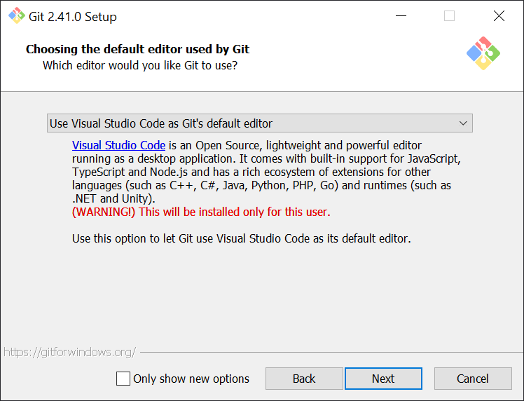
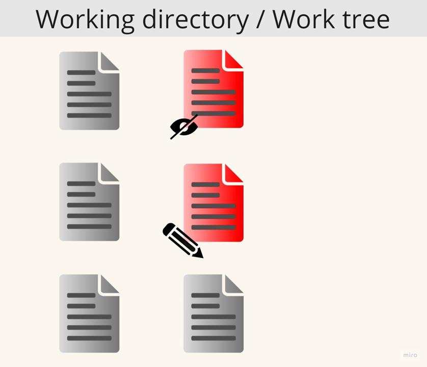

# Git notes

## Introduction

This document intends to show a simple but consistent workflow using Git, it will not focus on how Git works under the hood, but on how to use it effectively.

Git is a free and open source distributed version control system (VCS), that tracks changes made to a file or set of files over time, allowing developers to manage different versions of their codebase efficiently.

## 1. Installation (Windows)

For the installation we can leave most of the configurations as they are by default.

However there are 2 options that are highly recommended: 

- **Default editor used by Git**

    By default the editor that Git uses for commit messages, merge commits and so on is VI (Visual Improved).
    This editor although is light weight and efficient can be daunting at first.
    For that reason using a more friendly editor such as VSCode (VSCode installation required) is suggested.

    

    Notes: 

    In case you set Vi as the default editor and by accident you happen to enter the editor, to exit press `Esc` to enter normal mode then `:q!` to exit the file without saving changes.

    It is possible to change the default editor used by Git to VSCode (aliased as `code` with `--wait` flag) with the following command:

    ```bash
    git config --global core.editor "code --wait"
    ```
    You can view and edit the global config at `~/.gitconfig` (on Windows `C:\Users\username\.gitconfig`).
    
    (In case you set an invalid editor the command may not work and you will have to manually open and edit `.gitconfig`)

    To see the current default editor either view `.gitconfig` or use:

    ```bash
    git config --global core.editor
    ```
    
- **Default branch name used by Git**

    In Git for the first commit and once we get to Github for the display, there is a special branch that is set as default for the repository. 
    
    Historically the name of this branch has been **master**, however this is planned to be changed and is quite extended to use **main** as default branch name, which is what Github uses. 

    Although is not impactfull for our repositories history, since **master** is already an explicit name, once we get to Github we will see it suggests us to rename our **master** branch to **main**, which isn't complex and we might rename only once per repository so is not a big deal.

    This suggestion is for those who pretend to create a lot of online repositories, don't like **master** as default name or know for sure their workflows will use **main** as main branch for multiple local projects.

    It is possible to set the default branch name as **main** during installation:
    
    

    Can also be achieved by using:

    ```bash
    git config --global init.defaultBranch main
    ```

    To see the current default branch either view `.gitconfig` or use:

    ```bash
    git config --global init.defaultBranch
    ```

    (If you are letting Git decide, the command will fail and won't appear in `.gitconfig`)

Once the instalation is finished you can open a new terminal instance and pass the following command to check it was succesfully installed:

```bash
git --version
```

If git was installed and recognized the output of the command will be its version.

## 2. Bash commands

Some basic bash commands knowledge is suggested but feel free to skip this if already in knowing or if you want to use other CLI or an IDE.

| Command |       Description       | Common Args |                      Args Descriptions                      |
|:-------:|:-----------------------:|:-----------:|:-----------------------------------------------------------:|
|   pwd   | print working directory |             |                                                             |
|    ls   |      list directory     |      -a     |               view all (hidden files included)              |
|   echo  |     display message     |   -e > >>   | enable interpretation "\", overwrite, append (rhs with lhs) |
|  printf |      display string     |             |                                                             |
|    cd   |     change directory    |    . .. -   |                  current, parent, previous                  |
|  touch  |       create file       |             |                                                             |
|  mkdir  |     create directory    |             |                                                             |
|   cat   |    print all contents   |             |                                                             |
|    cp   |           copy          |      -r     |                   recursive (directories)                   |
|    mv   |      rename / move      |      -r     |                   recursive (directories)                   |
|    rm   |          remove         |    -r -f    |                recursive (directories), force               |

## 3. Initial configuration

Before we start with Git we have to set username and email. Either edit `.gitconfig` or use:

```bash
git config --global user.name "John Doe"
```

```bash
git config --global user.email "johndoe@email.com"
```

They are both required so Git can determine the author of a change in a project.

## 4. Initializing and status

|   Command  |               Description               |        Common Args        |               Args Descriptions              |
|:----------:|:---------------------------------------:|:-------------------------:|:--------------------------------------------:|
| git status |       Show the working tree status      |             -s            |         short-format (no branch info)        |
|  git init  |         Create a Git repository         |         \<location>        | If no location initializes current directory |
|  git clone | Clone a repository into a new directory | \<git-repo-url> \<location> |  If no location clones to working directory  |

A git repository is a regular directory whose changes are being tracked by Git through the `.git` folder. 

Folders and filenames preceeded by `.` are usually hidden by default, to view them in bash we could use:

```bash
ls -a
```

Git itself provides a command to output the tracking status of the current directory:

```bash
git status
```

This command will list all files and changes that aren't yet tracked by Git, and in case isn't a Git repository will output `fatal: not a git repository (or any of the parent directories): .git`.

To initialize a git repository locally we can use:

```bash
git init
```

We are able to provide a location at which will be initialized:

```bash
git init <location>
```

And for an existing remote repository (which will be covered later)

```bash
git clone <remote-git-repo-url>
```

Also possible to provide a location folder for the copied files from the remote repository.

```bash
git clone <remote-git-repo-url> <location>
```

Once we've done either one of those, using

```bash
git status
```

will tell us in which branch we are and some extra information related to changes.

Is worth noting, the flag `-s` which stands for short will return a short format output

```bash
git status -s
```

## 5. Adding and discarding changes

|         Command        |                                    Description                                    |
|:----------------------:|:---------------------------------------------------------------------------------:|
|         git add        |                   Add file contents to the index (stage changes)                  |
|  git restore --staged  | Restore index to before the changes were staged (doesn't touch working directory) |
|       git restore      |                    Restore working directory to match the index                   |
| git restore --worktree |                    Restore working directory to match the index                   |

How to make Git track our changes in a nutshell:
- First they exist in our working directory.
- Then we validate which ones we should keep using a preview of them (the index).
- Finally we tell git to create a version checkpoint with the changes we have selected (in advance commit).

We won't deep dive into how changes are saved in each area, we will instead take a more practical approach. For now as a short explanation of each area: 

|              Area             |            Description            |
|:-----------------------------:|:---------------------------------:|
| Working directory / Work tree |    Where your local files live    |
|       Index / Staging area      | Preview with a selection of changes |
|         Commited files        |  Local repository tracked by Git  |

To explain the upcoming examples, the following diagram will display the things that are in the index (a preview of what we want to end up) and what is in our working directory:


Note: Although we will refer to files in both areas indifferently (as the same), in reality Git doesn't copy our files but creates references (blue in the diagram).

As we said, the entry point are changes in our working directory.

Initially these are what Git calls unstaged changes, essentially are changes that are in our working directory but <ins> aren't in the preview </ins> (index / stage area). 

They could be of 2 types:
- Changes in files already known by Git
- New files that aren't known to Git

Simple example:



Right now our preview is clean, as we left it, but at some point we would like Git to track this new unstaged changes. 

The next step is called staging which is basically selecting which unstaged changes we want and preview them (could be some or all).

To stage a file / add it to the index:

```bash
git add file.txt
```

Note: To check which changes have been staged we can use `git status`

It is possible to stage multiple files at the same time separating them by spaces.

```bash
git add file1 file2 file3
```

To stage all changes in the current directory we could do it by using the relative path with `.`

```bash
git add .
```

(We can use either relative paths or absolute paths)

For the previous example lets say we want to add to the stage area only the new file (not known to Git):


(Same principle applies for adding files that have changed)

The preview is very flexible and allows us to see which files we want, it is also the closest point between the git repository and our working directory, however we may realize we didn't like some change we added to it.

It is possible to discard changes from either the index /staging area or the working directory / work tree.

To unstage changes, that is to discard them from the staging area, we could <ins>SAFELY</ins> use:

```bash
git restore --staged file.txt
```

The command `git restore --staged` is safe because it <ins>doesn't modify the working directory</ins>, it only forgets the changes that were staged into the index (stage area).


Note: If those changes are no longer in the working directory before we unstage, `git restore --staged` will not recover them, the command only removes/forgets what was added to the staging area.


Another thing we may need is to restore a file to the <ins>current state of the index</ins> (what has been staged with `git add`).

We can discard unstaged changes of a file (or an untracked file/folder) from the working directory, to match the index.

A simple way of accomplishing this is by using `git restore` (uses `--worktree` argument by default) for tracked files and `git clean -f` for untracked files and directories. Since we are modifying the state of the working directory these actions are <ins>DANGEROUS</ins>.

Discard unstaged changes of tracked files:

```bash
git restore file.txt
```

Or

```bash
git restore --worktree file.txt
```

Note: We can use the flags `--staged` and `--worktree` together to discard all changes either they are staged or unstaged. 

Discard untracked files:

```bash
git -f clean <file>
```

Notes: 
- `-f` flag stands for force and is required by default.
- `-d` flag is required for untracked directories.
- `-n` flag will show the result of a clean without doing it.

Example of use:


Note: `git restore --worktree` and `git clean -f` will not discard staged files, in fact if we use these commands our working directory will replicate the index. This makes sense since if we made changes after staging a file the index is the previous state of our working directory. 

Example starting with staged files:


In conclusion, the restore workflow will be `git restore --staged` -> `git restore` or `git clean`, this way we first unstage changes from the staging area without modifying the working directory and afterwards we have the option to discard from the working directory.

## 6. Commit and commit messages

|   Command  |            Description           | Common Args |             Args Description            |
|:----------:|:--------------------------------:|:-----------:|:---------------------------------------:|
| git commit | Record changes to the repository |    -a -m    | stage all TRACKED files, inline message |

Once we have the changes we want in our staging area, we are ready for commiting (generating a checkpoint).

```bash
git commit
```

This command will open a Git file with our default `core.editor`, in our case VSCode. We will then have to:

- Enter a commit message.
- Save the commit file.
- Close the commit window. 

Here are some <ins>IMPORTANT</ins> guidelines for a good commit message:

- Write your commit message subject in the imperative: "Fix bug" and not "Fixed bug" or "Fixes bug."
- Do not end the subject line with a period
- Separate subject from body with a blank line
- Capitalize the subject line and each paragraph
- Wrap lines at 72 characters
- Use the body to explain what and why you have done something

We can also commit in one line without having to enter our `core.editor` using the `-m` flag and passing our message between quotes:

```bash
git commit -m "Add foo.txt"
```

There is also the `-a` flag that stages all changes <ins> of already tracked files</ins> in the working directory before commiting, this way we can save ourselves from using `git add`:

```bash
git commit -a
```

In combination with `-m`:

```bash
git commit -a -m "Remove multiprocessing"
```

or

```bash
git commit -am "Remove multiprocessing"
```

## 7. Commit loggings and HEAD
|       Command      |                      Description                     |         Common Args         |                      Args Descriptions                      |
|:------------------:|:----------------------------------------------------:|:---------------------------:|:-----------------------------------------------------------:|
|       git log      |                   Show commit logs                   | --oneline \| -n \| --author | oneline-format, selection of last commits, filter by author |
| git --no-pager log | Show commit logs (without j/k navigation and q exit) | --oneline \| -n \| --author | oneline-format, selection of last commits, filter by author |

The git log command provides a way to see the commit history, however it may not be very intuitive compared to other GUI options.

```bash
git log
```

We can specify the flag `--oneline` for a shorter output at the cost of losing the body of the commit message.

```bash
git log --oneline
```

There are multiple other ways to format and filter the output, to name a couple useful:

Flag `-n` allows us to view the last **n** commits (where **n** is an integer). Example last 2 commits (HEAD and HEAD~1):

```bash
git log --oneline -n 2
```

Flag `--author` filters by commit author. Might be useful when working with multiple contributors. Example Alf-caput last 2 commits:

```bash
git log --oneline -n 2 --author=Alf-caput
```

Note: If the ouput of the command doesn't fit in the command window, git will enable a navigation mode that uses `j` to move down and `k` to move up.To exit this navigation mode press `q`. We can tell git to not enter this navigation mode if needed (it will print everything directly), by adding the `--no-pager` flag before `log` keyword.

```bash
git --no-pager log --oneline
```

Notes:

As was mentioned earlier, Git allows us to travel in time between changes and work in parallel timelines called branches. In this context `HEAD` is a reference of whatever we are pointing to and it will follow us as we create new commits or switch from timeline (`branch`).

If the `HEAD` isn't pointing to the tip of a `branch` is called `detached HEAD` this happens when we point to a specific commit that isn't at the tip of the branch.

## 8. Displaying changes

A key feature of git is that it allows us to view what has changed between versions. The `git diff` command allows us to view changes between commits, the index, the worktree, ...

Without arguments `git diff` will display changes between the working directory and the index. Shows what differs from the staging area (index).

```bash
git diff 
```

Note: The command accepts paths to show specific files only. 

```bash
git diff file2.txt some/path/to/file2.txt
```

With the flag `--staged` changes between the index and the `HEAD` will be displayed. Shows what differs from `HEAD`.

```bash
git diff --staged
```

Remainder: `HEAD` is a reference to a commit we are pointing to. Tipically it will be the tip of the `branch` and will follow us automatically as we commit or switch branches but it can also be a certain commit we have checked out in which case is called `detached HEAD`.

Last command is equivalent to:

```bash
git diff --staged HEAD
```

To display changes between 2 commits:

```bash
git diff commit2-id commit1-id
```

The command shows what has changed from the second commit passed, in order to match the first commit passed (commit2-id in this example).

It is also possible to `git diff` commits referencing them by their relativity with `HEAD`. To refer to a version that is **n** commits behind `HEAD` (where **n** is an integer) we would use `HEAD~n`.

For example, if we want to compare `HEAD` with previous commit we would use:

```bash
git diff HEAD~1 HEAD
```

Notes:

- If the name of a file starts with `-`, when using this command we can use `--` flag before specifying paths and prevent Git from thinking is an option/flag.

- We can also `git diff --staged HEAD~n` to compare the index with a version that is **n** commits behind.
