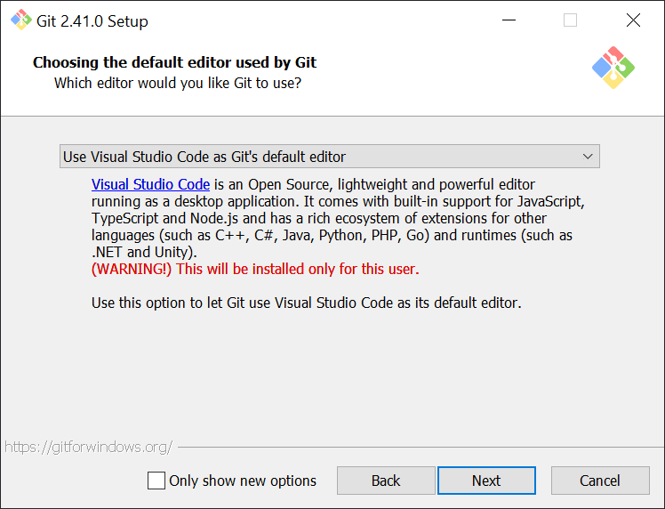

# Git notes
## Introduction
This document intends to show a simple but consistent workflow using Git, it will not focus on how Git works under the hood, but on how to use it efficiently.

Git is a free and open source distributed version control system (VCS), that tracks changes made to a file or set of files over time, allowing developers to manage different versions of their codebase efficiently.

## 1. Installation (Windows)
For the installation we can leave most of the configurations as they are by default.

However there are 2 options that are highly recommended: 

- **Choosing the default editor used by Git**

    By default the editor that Git uses for commit messages, merge commits and so on is VI (Visual Improved).
    This editor although is light weight and efficient can be daunting at first.
    For that reason we suggest using a more friendly editor such as VSCode (VSCode installation required).

    

    Notes: 

    In case you set Vi as the default editor and by accident you happen to enter the editor, to exit press `Esc` to enter normal mode then `:q!` to exit the file without saving changes.

    It is possible to change the default editor used by Git to VSCode (aliased as `code` with `--wait` flag) with the following command:

    ```bash
    git config --global core.editor "code --wait"
    ```
    You can view and edit the global config at `~/.gitconfig` (on Windows `C:\Users\username\.gitconfig`).
    
    (In case you set an invalid editor the command may not work and you will have to manually open and edit `.gitconfig`)

    To see the current default editor either view `.gitconfig` or use:
    ```bash
    git config --global core.editor
    ```
<!-- 
    It is also possible to set or view the default editor only for the local repo by using the `--local` flag

    For the local repo the `.git` folder contains the `config` file. -->
