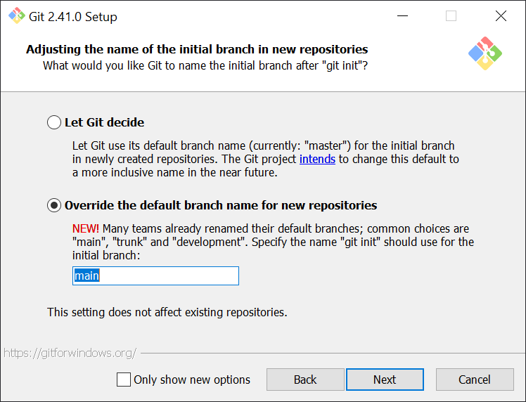

# Git notes

## Introduction

This document intends to show a simple but consistent workflow using Git, it will not focus on how Git works under the hood, but on how to use it efficiently.

Git is a free and open source distributed version control system (VCS), that tracks changes made to a file or set of files over time, allowing developers to manage different versions of their codebase efficiently.

## 1. Installation (Windows)

For the installation we can leave most of the configurations as they are by default.

However there are 2 options that are highly recommended: 

- **Default editor used by Git**

    By default the editor that Git uses for commit messages, merge commits and so on is VI (Visual Improved).
    This editor although is light weight and efficient can be daunting at first.
    For that reason using a more friendly editor such as VSCode (VSCode installation required) is suggested.

    

    Notes: 

    In case you set Vi as the default editor and by accident you happen to enter the editor, to exit press `Esc` to enter normal mode then `:q!` to exit the file without saving changes.

    It is possible to change the default editor used by Git to VSCode (aliased as `code` with `--wait` flag) with the following command:

    ```bash
    git config --global core.editor "code --wait"
    ```
    You can view and edit the global config at `~/.gitconfig` (on Windows `C:\Users\username\.gitconfig`).
    
    (In case you set an invalid editor the command may not work and you will have to manually open and edit `.gitconfig`)

    To see the current default editor either view `.gitconfig` or use:

    ```bash
    git config --global core.editor
    ```

<!-- 
    It is also possible to set or view the default editor only for the local repo by using the `--local` flag

    For the local repo the `.git` folder contains the `config` file. -->

    
- **Default branch name used by Git**

    In Git for the first commit and once we get to Github for the display, there is a special branch that is set as default for the repository. 
    
    Historically the name of this branch has been **master**, however this is planned to be changed and is quite extended to use **main** as default branch name, which is what Github uses. 

    Although is not impactfull for our repositories history, since **master** is an explicit name, once we get to Github we will see it suggests us to rename our **master** branch to **main**, which isn't complex and we might rename only once per repository so is not a big deal.

    This suggestion is for those who pretend to create a lot of online repositories, don't like **master** as default name or know for sure their workflows will use **main** as main branch for multiple local projects.

    It is possible to set the default branch name as **main** during installation:
    
    

    Can also be achieved by using:

    ```bash
    git config --global init.defaultBranch main
    ```

    To see the current default branch either view `.gitconfig` or use:

    ```bash
    git config --global init.defaultBranch
    ```

    (If you are letting Git decide, the command will fail and won't appear in `.gitconfig`)

Once the instalation is finished you can open a new terminal instance and pass the following command to check it was succesfully installed:

```bash
git --version
```

If git was installed and recognized the output of the command will be its version.

## 2. Bash commands

Some basic bash commands knowledge is suggested but feel free to skip this if already in knowing or if you want to use other CLI or an IDE.

| Command |       Description       | Common Args |         Args Descriptions        |
|:-------:|:-----------------------:|:-----------:|:--------------------------------:|
|   pwd   | print working directory |             |                                  |
|    ls   |      list directory     |      -a     | view all (hidden files included) |
|   echo  |     display message     |     > >>    | overwrite, append (rhs with lhs) |
|    cd   |     change directory    |    . .. -   |     current, parent, previous    |
|  touch  |       create file       |             |                                  |
|  mkdir  |     create directory    |             |                                  |
|   cat   |    print all contents   |             |                                  |
|    cp   |           copy          |      -r     |      recursive (directories)     |
|    mv   |      rename / move      |      -r     |      recursive (directories)     |
|    rm   |          remove         |    -r -f    |  recursive (directories), force  |
|         |                         |  --version  |              version             |

## 3. Initial configuration

Before we start with Git we have to set username and email. Either edit `.gitconfig` or use:

```bash
git config --global user.name "John Doe"
```

```bash
git config --global user.email "johndoe@email.com"
```

They are both required so Git can determine the author of a change in a project.

## 4. Initializing and status

|   Command  |               Description               |        Common Args        |              Args Descriptions             |
|:----------:|:---------------------------------------:|:-------------------------:|:------------------------------------------:|
| git status |       Show the working tree status      |             -s            |        short-format (no branch info)       |
|  git clone | Clone a repository into a new directory | \<git-repo-url> \<location> | If no location clones to working directory |
|  git init  |         Create a Git repository         |                           |                                            |

A git repository or git repo is a regular directory whose changes are being stracked by Git through the `.git/` folder. 

Folders and filenames preceeded by `.` are usually hidden by default, to view them in bash we could use:

```bash
ls -a
```

Git itself provides a command to output the tracking status of the current directory:

```bash
git status
```

This command will list all files and changes that aren't yet tracked by Git, and in case isn't a Git repository will output `fatal: not a git repository (or any of the parent directories): .git`.

To initialize a git repository locally we can use:

```bash
git init
```

being able to provide a location at which will be initialized

```bash
git init <location>
```

or for an existing remote repository (which will be covered later)

```bash
git clone <remote-git-repo-url>
```

We can also use a different name for the cloned repository passing a second argument

```bash
git clone <remote-git-repo-url> <custom-name>
```

Once we've done either one of those, using

```bash
git status
```

will tell us in which branch we are and some extra information related to changes.

Is worth noting, the flag -s which stands for short will return a short format output

```bash
git status -s
```

## 5. Adding and commiting

Locally changes in a git repository can be in one of this phases:


First we add the changes to the staging area (in advance stage changes) with:

```bash
git add <file.txt>
```

Note: To check which changes have been staged we can use `git status`

It is possible to stage multiple files at the same time separating them by spaces.

```bash
git add <file1> <file2> <file3>
```

To stage all changes in the current directory we could do it by using the relative path with `.`

```bash
git add .
```

(We can use either relative paths or absolute paths)

To unstage changes, that is to discard them from the staging area, we could use:

```bash
git restore --staged <file>
```

This is safe to do, however without the `--staged ` flag it will restore the file changes to git's last commit either if those changes are staged or not (if not tracked it will not delete the file). Therefore without the `--staged` flag the command 
`git restore` is <ins>DANGEROUS</ins>

```bash
git restore <file>
```

Note: Is not dangerous if the file isn't still tracked by git, that is, it has never been commited.
